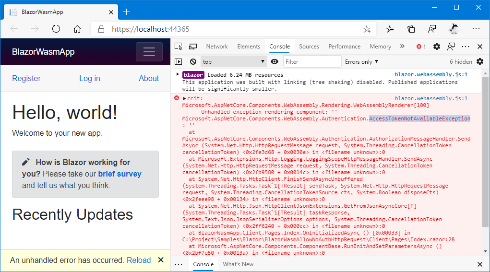

# Blazor Samples - How to send HTTP requests to the anonymously accessible endpoint without access token on an authentication enabled Blazor Wasm App?

This is a sample code repository of a Blazor Wasm app.

This repository describes how to send HTTP requests to the anonymously accessible endpoint without access token on an authentication enabled Blazor Wasm App.

## What is a problem?

The `master` branch reproduces the problem what this repository will describe.

If you clone this repository on your computer, check out the `master` branch, and execute "dotnet run", you will see `AccessTokenNotAvailableException` error.

This error causes when sending HTTP requests from the Blazor Wasm App to the Web API endpoint live in it's hosted server process before signed in, even though that endpoint is allowed anonymous access.

Because the Blazor app which was created from the default project template with the "Authentication" option enabled always tries to attach an access token to any HTTP requests whether the user is signed in or not.

## Solutions

### Solution 1

[The `soulution1` branch](https://github.com/sample-by-jsakamoto/Blazor-AllowNoAuthHttpRequest/commits/solution1) resolved the issue above, by configuring "AuthorizationMessageHanlder" to allow attaching an access token to only selected endpoint under the specified subpath.

### Solution 2

[The `soulution2` branch](https://github.com/sample-by-jsakamoto/Blazor-AllowNoAuthHttpRequest/commits/solution2) also resolved that issue.

This solution explicitly gets a named HTTP client which is configured to attach an access token from "IHttpClientFactory", when sending HTTP requests to authorization required endpoint.

### Solution 3

[The `soulution3` branch](https://github.com/sample-by-jsakamoto/Blazor-AllowNoAuthHttpRequest/commits/solution3) is another solution of opposite to "solution2".

This solution explicitly gets a named HTTP client which is plain one from "IHttpClientFactory", when sending HTTP requests to anonymous access allowed endpoint.

## License

[The Unlicense](LICENSE)